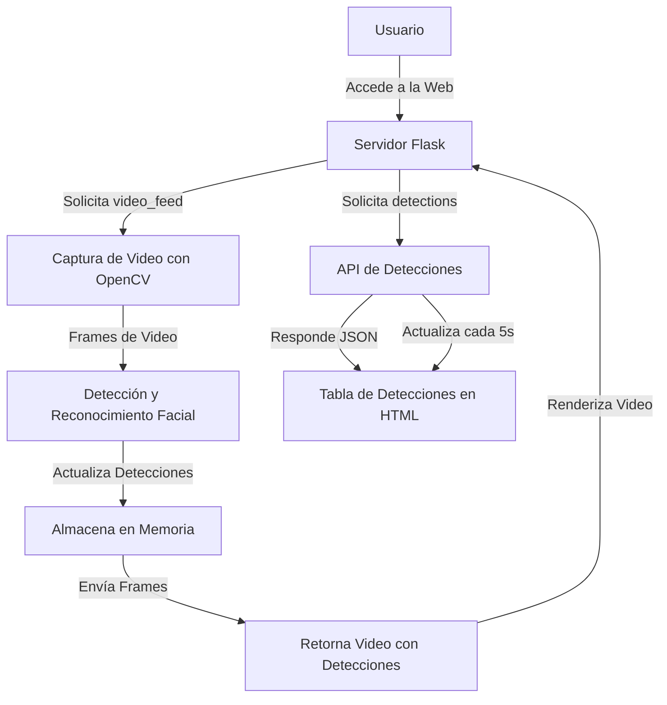

# Detección y Reconocimiento Facial en Tiempo Real

Esta es una aplicación web que utiliza la detección y el reconocimiento facial en tiempo real. La aplicación detecta rostros utilizando un modelo preentrenado y muestra el nombre de la persona detectada junto con la hora de la detección.

## ¿Cómo funcionará la aplicación?

- Usuario: El usuario accede a la aplicación web desde su navegador.
- Servidor Flask: El servidor Flask recibe la solicitud de acceso a la web.
- Captura de Video con OpenCV: El servidor Flask solicita el feed de video, y OpenCV captura los frames de video en tiempo real.
- Detección y Reconocimiento Facial: Los frames de video se procesan para detectar y reconocer rostros utilizando la biblioteca face_recognition.
- Almacena en Memoria: Las detecciones (nombre y hora) se almacenan en una lista en memoria.
- Retorna Video con Detecciones: Los frames procesados se envían de vuelta al servidor Flask, que los retorna al navegador del usuario.
- Renderiza Video: El navegador del usuario renderiza el video con las detecciones superpuestas.
- API de Detecciones: Cuando el navegador solicita las detecciones, el servidor Flask responde con un JSON que contiene las detecciones almacenadas.
- Tabla de Detecciones en HTML: El navegador del usuario actualiza la tabla de detecciones en la interfaz web cada 5 segundos con la información recibida de la API de detecciones.

## Motivación

Este proyecto es parte del curso "Especialista en Inteligencia Artificial (IFCD107)" y tiene como objetivo practicar y demostrar habilidades en la creación de aplicaciones de inteligencia artificial y su despliegue en contenedores y clústeres de Kubernetes*.

> ⚠️ Tanto los requisitos como las dependencias definidas aquí pueden cambiar a medida que pruebo conceptos y desarrollo la aplicación.

## Requisitos

- Python 3.8
- Docker
- Kubernetes*

## Dependencias

- [OpenCV](https://opencv.org/): Biblioteca de Visión por Computadora.
- [dlib](http://dlib.net/): Biblioteca de aprendizaje automático utilizada para la detección de rostros.
- [face_recognition](https://pypi.org/project/face-recognition/):  Biblioteca de reconocimiento facial basada en dlib.
- [pickle](https://docs.python.org/3/library/pickle.html): Módulo de Python que se utiliza para serializar y deserializar objetos. Aquí se utilizará para guardar las codificaciones de las fotos de los rostros y los nombres y cargarlos cuando se ejecute en la aplicación.
- [datetime](https://docs.python.org/3/library/datetime.html): Módulo de Python para manipular fechas y horas. 

## Instalación y Ejecución

### Localmente

tba

### Docker

tba

### Kubernetes

tba

### Licencia

Este proyecto está bajo la licencia Unlicense - ver el archivo LICENSE para más detalles.

## Referencias

tba

## Comentarios

*La funcionalidad para el despliegue en Kubernetes solo se desarrollará si dispongo de suficiente tiempo para configurar un cluster.